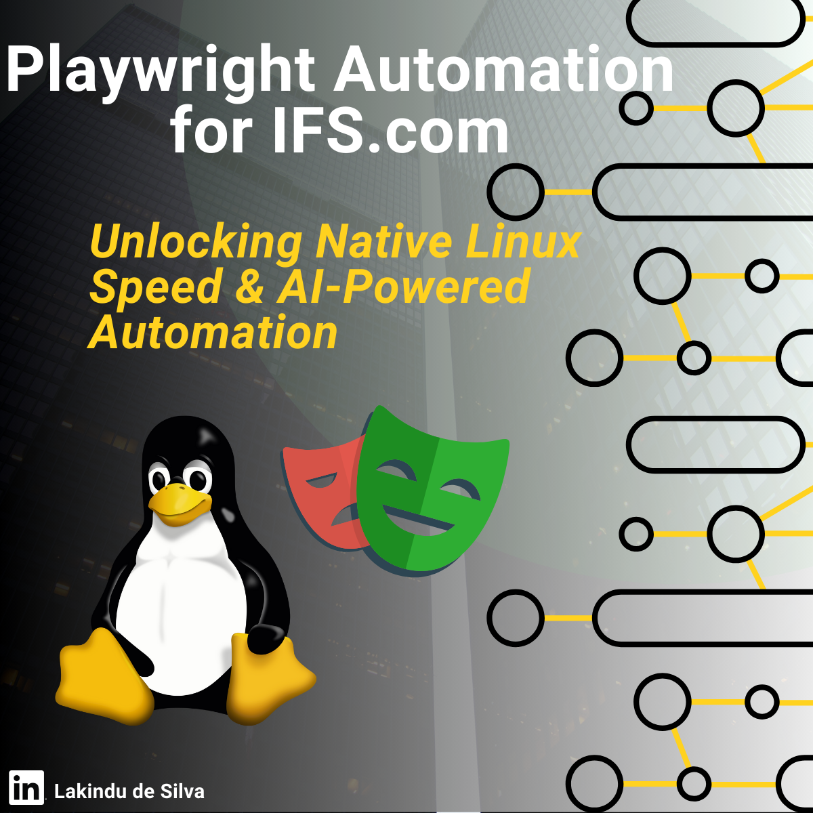
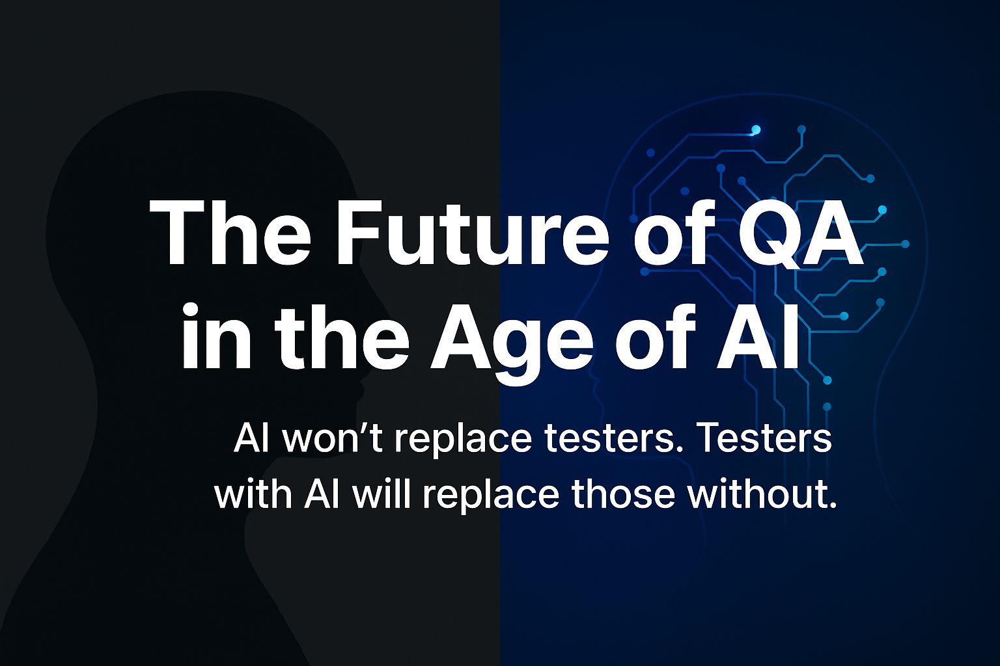
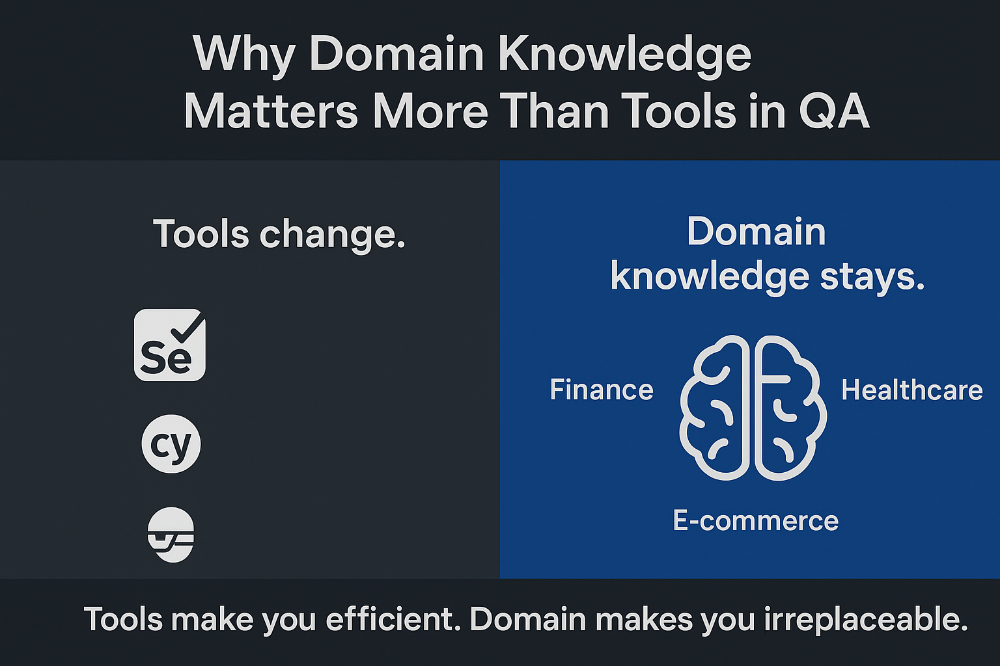
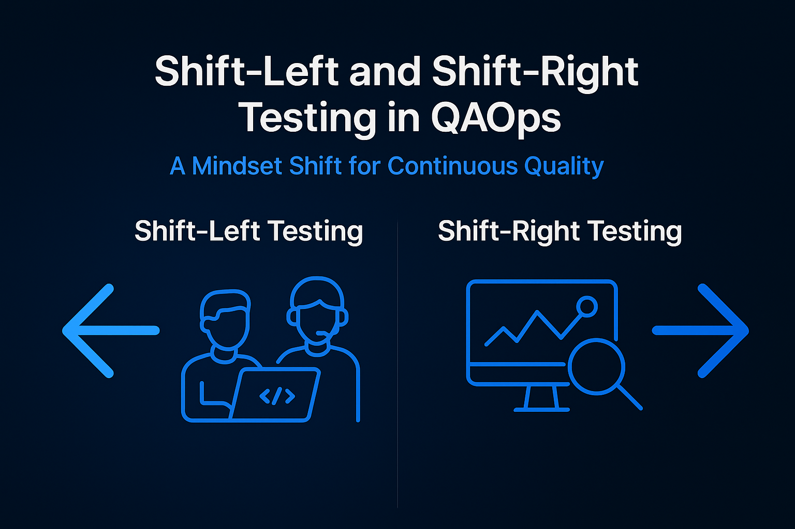
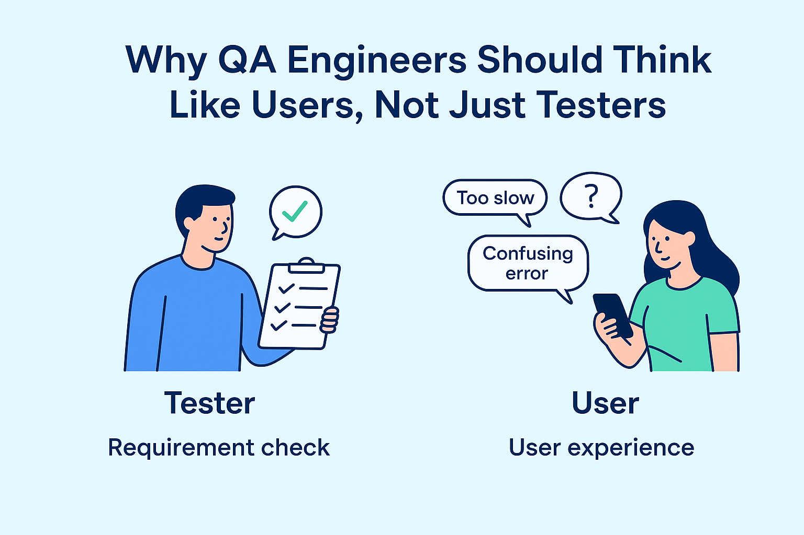
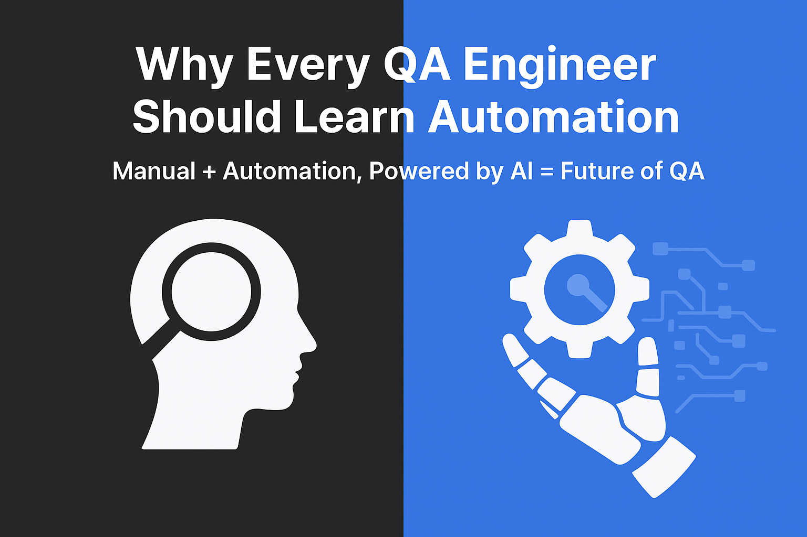
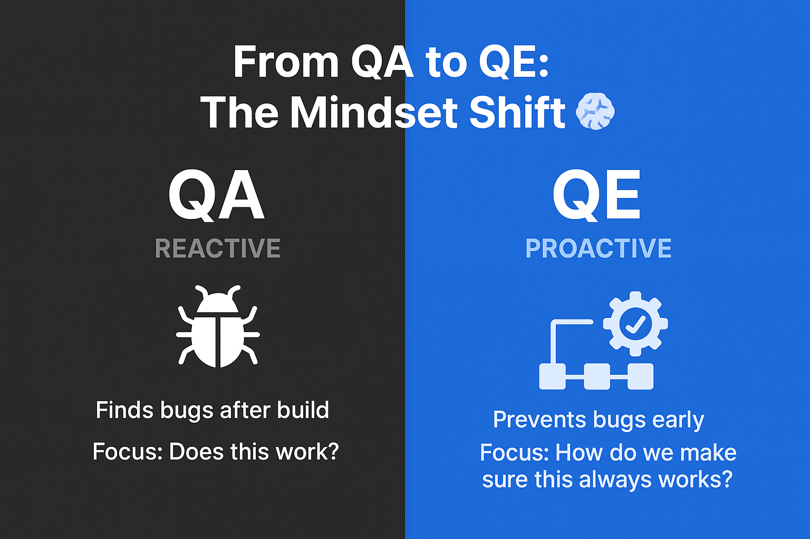

# 🧑🏻‍💻 Lakindu De Silva

**`Undergraduate | QA Enthusiast | Test Automation`**

Self-taught QA Engineer with hands-on experience in UI, API, performance, database, and security testing. Skilled in building end-to-end test pipelines, integrating CI/CD and accessibility testing, and applying Agile and DevOps practices to help teams deliver software faster while maintaining reliability and quality. Actively contributes to the QA community by sharing knowledge and insights on [LinkedIn](https://www.linkedin.com/in/lakindu-de-silva/) and [Medium](https://medium.com/@lakindudesilva007).

**`Connect With Me`**

  

---

## `Technical Skills`

> Modern testing methodologies, tools, and technologies for software quality.

**Testing & Methodologies**  

**Testing Types**  

**Automation & Testing Tools**  

**Languages & Scripting**  

**DevOps & Version Control**  

**Project Management & Frameworks**  

---

## `Featured Projects`

<table>
<tr>
<td align="center" bgcolor="#f0f4f8" width="300" style="border-radius:10px; padding:10px;">
  
<a href="https://github.com/LakinduQA/playwright_ifs.com"><b>Playwright Automation for IFS.com</b></a> 
End-to-end UI automation using Playwright.
</td>

<td align="center" bgcolor="#f0f4f8" width="300" style="border-radius:10px; padding:10px;">
  
<a href="https://github.com/LakinduQA/STLC-Implementation---Sauce-Demo-E-commerce-Platform"><b>STLC Implementation – Sauce Demo E-commerce</b></a> 
Applying the Software Testing Life Cycle on a real-world demo application.
</td>
</tr>
</table>

---

## `Latest Articles & Insights`

<table>
<tr>
<td align="center">
<a href="https://medium.com/@lakindudesilva007/the-future-of-qa-in-the-age-of-ai-will-ai-replace-testers-or-make-us-stronger-3cfb7fbcee43">
 
 The Future of QA in the Age of AI
</a>
</td>

<td align="center">
<a href="https://medium.com/@lakindudesilva007/why-domain-knowledge-matters-more-than-tools-in-qa-1bdb15c74237">
 
 Why Domain Knowledge Matters More Than Tools in QA
</a>
</td>

<td align="center">
<a href="https://medium.com/@lakindudesilva007/shift-left-and-shift-right-testing-in-qaops-a-mindset-shift-for-continuous-quality-85ef943ed14f">
 
 Shift-Left and Shift-Right Testing in QAOps
</a>
</td>
</tr>

<tr>
<td align="center">
<a href="https://www.linkedin.com/posts/lakindu-de-silva-460581344_why-qa-engineers-should-think-like-users-activity-7368506178466664449-5NvE">
 
 Why QA Engineers Should Think Like Users
</a>
</td>

<td align="center">
<a href="https://www.linkedin.com/posts/lakindu-de-silva-460581344_why-every-qa-engineer-should-learn-automation-activity-7367105682224934913-p9X8/">
 
 Why Every QA Engineer Should Learn Automation
</a>
</td>

<td align="center">
<a href="https://www.linkedin.com/posts/lakindu-de-silva-460581344_from-quality-assurance-to-quality-engineering-activity-7367848560391880705-c-hk">
 
 From Quality Assurance to Quality Engineering
</a>
</td>
</tr>
</table>

**`Follow me for more`**

---

Manual precision. Automated efficiency. Consistent quality.

